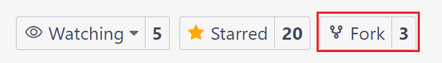
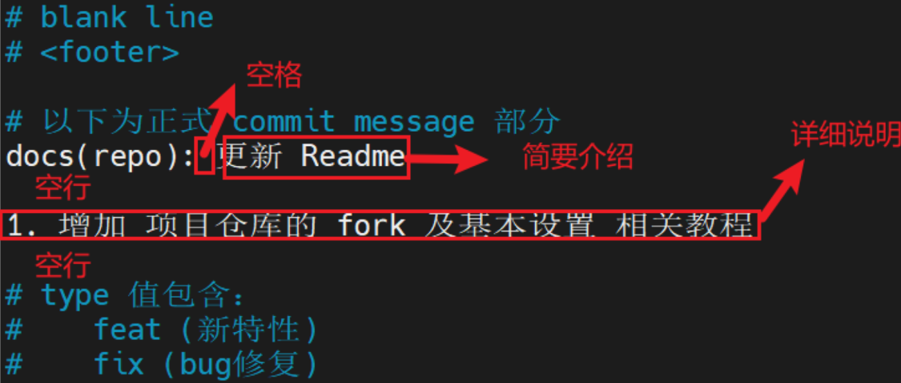
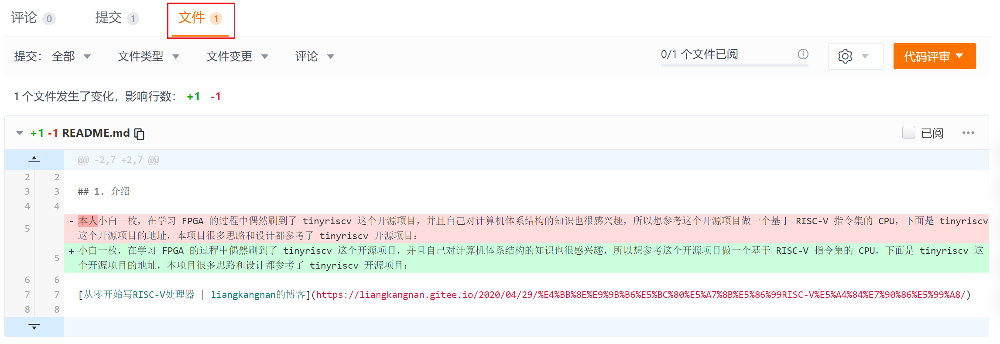
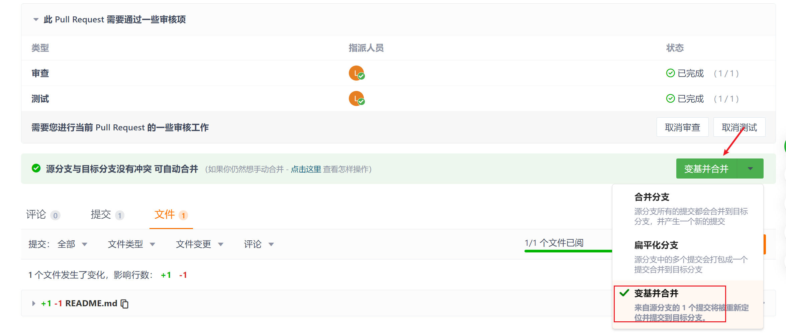
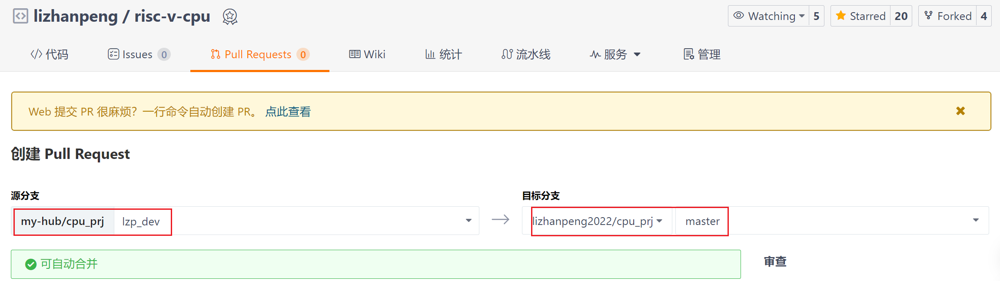

# 协作开发流程

## 1. fork 项目

>fork 的作用是将主仓库复制一份到个人仓库中，对个人仓库的修改不会影响主仓库

点击仓库右上角的 Fork 按钮将项目 fork 到个人仓库中：


## 2. clone 仓库

>clone 的作用是把仓库的项目克隆到本地

在 fork 的仓库主页复制 git 链接：


然后将项目克隆到本地：
```
git clone <repo_link>
```

## 3. 新建开发分支
```
git checkout -b 用户名_dev
git push --set-upstream origin 用户名_dev
```

>master 分支主要用于同步主仓库的代码，开发分支为实际做修改的分支。


push 之后仓库就会多出一个开发分支：


## 4. 提交
在做完上面几个步骤后，就可以在你的开发分支上进行开发啦！在每次本地开发完成后，可以将你的修改同步到线上仓库。

### 4.1 设置 git 用户名和邮箱
```
git config --global user.name "你的用户名"
git config --global user.email "你注册的邮箱"
```
### 4.2 免密 push
可以解决 git push 时每次都需要输入用户名和密码的问题：
```
# cpu_prj 目录下输入
git config  credential.helper store
# 将本次修改推送到远程仓库
git push
# 输入账号密码后，下次 push 就不用输入了
```
### 4.3 提交修改
在解决了某个 bug 或者完成了某个功能后，生成一次 commit 来保存修改。

1. ```git status``` 查看有变动的文件，比如我修改了 README.md 的内容，并且新建了一个 COOPERATE.md 的文件：

2. ```git add .``` 将所有变动的文件都加入到暂存区：

3. ```git commit``` 填写 commit message，将修改提交，[git commit message 规范](https://www.jianshu.com/p/eb3ab7dcaecc)：

4. ```git push``` 将修改提交到 Gitee 仓库（支持多次 commit 操作之后一起提交到 Gitee 仓库）：


## 5. 同步项目主仓库的修改
### 5.1 同步主仓库
>如果发现主仓库的 master 分支有更新，可以将主仓库 master 分支的变动同步到个人仓库的 master 分支

在 gitee 个人仓库，选择 master 分支，然后点击同步按钮并确认同步。

稍等片刻就会把项目主仓库（lizhanpeng/risc-v-cpu）的更改同步到个人仓库的 master 分支（**覆盖，不保留更改！！**）


### 5.2 通过 gitee 将 master 更改合并到开发分支
>该操作的目的是将 master 分支的改动合并到开发分支，以同步主仓库的最新代码，但是可能有冲突需要解决。
1. 在仓库主页点击 **+Pull Request**：

2. 将源分支和目标分支中的仓库都改成个人仓库，源分支选择刚刚同步的 master 分支，目标分支为开发分支：

3. 创建 Pull Request 后，需要审查后才能真正同步到个人开发分支中（避免盲目同步导致个人代码丢失）：

4. 在文件一栏可以看到本次合并影响的文件以及对应的修改：

5. 审查通过-测试通过后，选择 **变基并合并**， 然后**接受 Pull Request**：

6. 然后在开发机的项目目录下输入 ```git pull --rebase```，更新本地代码：


## 6. 将代码提交到项目主仓库
在完成一个模块并且保证测试无误之后，提交修改到主仓库。

提交方式为新建 Pull Request，源分支为个人仓库的开发分支，目的分支为主仓库的master分支，提交之后会进行审查及测试，以上过程无误后管理员会接受本次 Pull Request。

