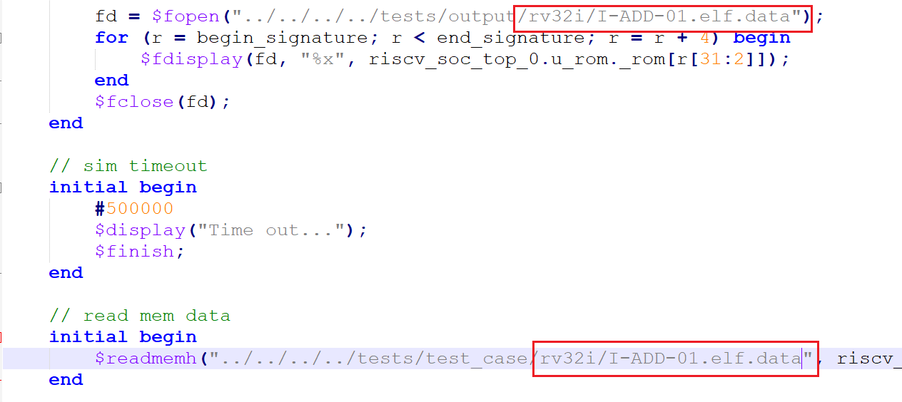
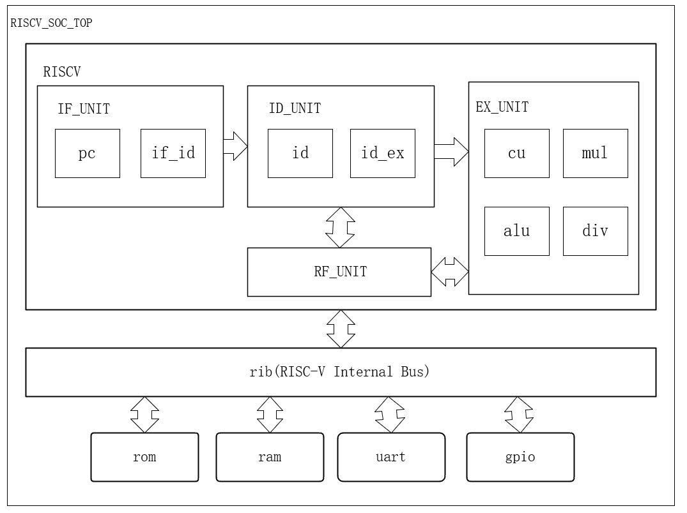

# RISC-V 处理器设计

### 介绍

本人小白一枚，在学习FPGA的过程中偶然刷到了tinyriscv这个开源项目，并且自己对计算机体系结构的知识也很感兴趣，所以想参考这个开源项目做一个基于RISC-V指令集的CPU，下面是tinyriscv这个开源项目的地址，本项目很多思路和设计都参考了tinyriscv开源项目：

[从零开始写RISC-V处理器 | liangkangnan的博客](https://liangkangnan.gitee.io/2020/04/29/%E4%BB%8E%E9%9B%B6%E5%BC%80%E5%A7%8B%E5%86%99RISC-V%E5%A4%84%E7%90%86%E5%99%A8/)

[tinyriscv: 一个从零开始写的极简、非常易懂的RISC-V处理器核](https://gitee.com/liangkangnan/tinyriscv#https://gitee.com/liangkangnan/tinyriscv_vivado)

### 项目说明
本项目是一个采用三级流水线设计，顺序、单发射、单核的32位RISC-V处理器。

采用哈佛结构，指令和数据分开存储。目前已经实现了RV32I 基本指令集中的37条指令：

项目架构图：

### 2023年7月22号：
1. 支持RV32M扩展指令集
2. 增加总线模块rib.v

### 使用说明
项目文件结构
1.  doc：相关文档
2.  serial_utils：串口烧录脚本，通过串口把二进制程序烧录到处理器的存储空间上
3.  FPGA：移植到板子上的工程（目前还在更新中，基于野火征途PRO开发板）
   
如何将C语言编译成riscv上可运行的二进制程序？如何将编译好的二进制程序烧录到板子上？请参考我的这篇博客(https://blog.csdn.net/qq_51103378/article/details/131498891?spm=1001.2014.3001.5501)
### 博客传送门

1.  [RISC-V处理器的设计与实现（一）—— 基本指令集](https://blog.csdn.net/qq_51103378/article/details/131201501?spm=1001.2014.3001.5501)
2.  [RISC-V处理器的设计与实现（二）—— CPU框架设计](https://blog.csdn.net/qq_51103378/article/details/131383341?spm=1001.2014.3001.5501)
3.  [RISC-V处理器的设计与实现（三）—— 上板验证（基于野火征途Pro开发板）](https://blog.csdn.net/qq_51103378/article/details/131430334?spm=1001.2014.3001.5502)
4.  [开发一个RISC-V上的操作系统（一）—— 环境搭建](https://blog.csdn.net/qq_51103378/article/details/131498891?spm=1001.2014.3001.5501)
5.  [开发一个RISC-V上的操作系统（二）—— 系统引导程序（Bootloader）](https://blog.csdn.net/qq_51103378/article/details/131873548?spm=1001.2014.3001.5502)
