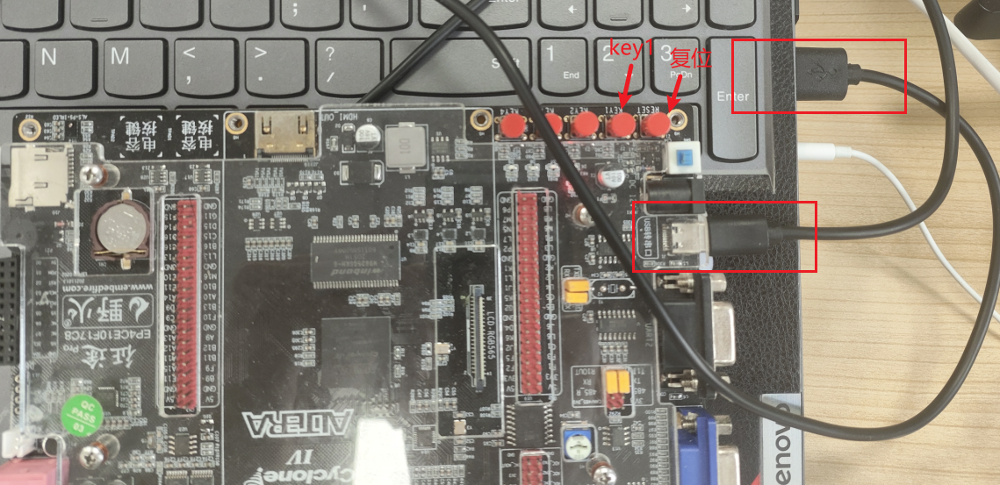

# 1. 介绍

本人小白一枚，在学习 FPGA 的过程中偶然刷到了 tinyriscv 这个开源项目，并且自己对计算机体系结构的知识也很感兴趣，所以想参考这个开源项目做一个基于 RISC-V 指令集的 CPU。

**目前本项目的 CPU 端目前大致已经开发完毕，并且成功把 RT-Thread nano 内核移植到本 CPU 上运行。如果大家对 RISC-V CPU 或者 RT-Thread 感兴趣的话，欢迎大家 star~**

# 2. 项目说明
本项目实现的是一个单核 32 位的小型 RISC-V 处理器核，采用 verilog 语言编写。有如下特点：
1. 支持 RV32IM 指令集（除了 FENCE 指令），通过 RISC-V 指令兼容性测试；
2. 采用哈佛结构，指令和数据分开存储；
3. 采用三级流水线，即取指，译码，执行；
4. 可以运行 C 语言程序；
5. **rom 和 ram 可以综合到 bram 上，支持更大的空间**；
6. 支持中断；
7. 支持总线；
8. 支持串口烧录程序；
9. 容易移植到任何 FPGA 平台（只要资源足够）；
10. **支持 RT-Thread nano**；


本项目目录结构：
1.  doc：该目录包含一些手册和文档；
2.  serial_utils：该目录包含串口烧录脚本，以及一些测试例子；
3.  FPGA：存放 FPGA 相关文件，包括 rtl 文件和仿真文件（成功移植到野火征途PRO开发板）；
4.  rt-thread：基于 riscv 的 rtthread nano 实现，能在本 cpu 上运行；
5.  tests：包含 RISC-V 指令兼容性测试程序源码；
6.  tools：存放一些通用脚本工具；

项目架构图：


# 3. 如何使用
## 3.1 FPGA 开发
本项目 FPGA 部分的开发是在 Windows 平台上进行的，开发软件使用 Quartus，仿真使用 ModelSim，FPGA 相关的代码全在 FPGA 目录下。

## 3.2 RT-Thread 操作系统开发
C 程序（如 rt-thread 操作系统）的编译和 python 脚本的执行是可以双平台的，Windows 和 Ubuntu 都支持。

### 3.2.1 Windows 平台下环境搭建
1. GNU 工具链（链接：https://pan.baidu.com/s/1Bdmn-FH0T7ekm2kMxkzJTw?pwd=qn69 提取码：qn69），百度云下载解压后，将 bin 目录添加到环境变量里即可。
2. make 工具（链接：https://pan.baidu.com/s/1X-F1BVPMa3-B-V1EHB4tEQ?pwd=418d 提取码：418d），百度云下载解压后，将 bin 目录添加到环境变量里即可。
3. Python 3.7

### 3.2.2 Ubuntu 平台下环境搭建
Ubuntu 版本：
```
$ lsb_release -a
No LSB modules are available.
Distributor ID:	Ubuntu
Description:	Ubuntu 20.04.2 LTS
Release:	20.04
Codename:	focal
 
$ uname -r
5.15.0-76-generic
```
安装Ubuntu 20.04官方提供的 GNU工具链：

```
sudo apt update
sudo apt install build-essential gcc make perl dkms git gcc-riscv64-unknown-elf
```

## 3.3 上板测试（野火征途PRO开发板）
### 3.3.1 选择板子型号以及配置引脚
首先选择好自己板子的型号，下面是我的板子的型号：


然后配置引脚，clk 接你板子的系统时钟，rst_n 接上板子的复位按键，gpio 接上板子的 led，uart_debug_pin 接上板子的任意按键（这里接的 key1），uart_rx 和 uart_tx 分别接板子的串口接收与发送端口：


### 3.3.2 上板测试
有两种将编译好的二进制程序在本 CPU 上执行的方法。

**第一种：直接作为 FPGA 比特流的一部分下载到板子上。**

1. 先将二进制程序转换为十六进制的指令格式，以流水灯程序 led_flow.bin 为例，进入到 serial_utils/binary 目录下，执行如下语句生成指令文件 led_flow.inst：
    ```
    python ../../tools/bin_to_mem.py led_flow.bin led_flow.inst
    ```
2. 再将 FPGA/rtl/perips/rom.v 文件里面的如下部分的注释打开，并且将路径改为生成的指令文件 led_flow.inst 的路径：

3. 重新编译后，直接烧录到板子上即可，烧录后出现流水灯现象即为成功：


**第二种：使用串口烧录程序。**

1. 重新编译后，将编译好的 .jic 或 .sof 文件烧录到板子上，然后进入 ```serial_utils``` 目录，先按住 key1 不动：

2. 然后执行如下语句烧录流水灯程序 led_flow.bin，烧录完成后即可松开 key1：
    ```
    # 这里的 COM 号要根据你自己的来选，我这里是 COM3
    python .\serial_send.py COM3 .\binary\led_flow.bin
    ```
    
3. 烧录完成后，**按下复位键**，若发现板子上 led 交替闪烁，即为成功。

两种方法相比，第一种方法更为稳妥，第二种方法更为灵活，这里更建议大家使用第一种方法，在程序出问题的时候，第一种方法还可以使用 modelsim 仿真调试。

第二种方法目前还不太稳定，如果遇到第二种方法烧录失败可以多烧录几次（可能因为接触不良），或者尝试一下第一种方法。
## 3.4 运行指令测试程序
测试集存放在 ```tests/test_case``` 目录下，以 **I-ADD-01.elf.data** 为例，首先修改仿真文件 **tb_riscv_top** 的文件路径：


然后使用 modelsim 软件进行仿真，仿真完后可以看到 ```tests/output/rv32i``` 目录下 **I-ADD-01.elf.out** 文件更新，然后运行 compare.py 脚本进行比对：
```
 python ./compare.py rv32i
```
运行后可以看到指令测试结果 PASS。


# 4. 更新记录
2023年6月13号：第一次提交。

2023年6月20号：添加串口烧录模块，可以通过串口下载程序到 rom 中。

2023年6月28号：成功将cpu移植到板子上，并且跑起 c 实现的流水灯程序。

2023年7月2号：更新了 rom 和 ram 的存储模式，读出的数据要延后一个时钟周期，带来的好处是可以将 rom 和 ram 所使用的资源综合到 bram 上。

2023年7月22号：
1. 更新 RV32M 扩展指令集
2. 增加总线模块rib.v

2023年8月8号
1. 更新 ecall，ebreak 同步中断；uart异步中断
2. 更新 csr 寄存器操作

2023年8月13号
1. 新增定时器外设
2. 支持Machine模式与User模式

2023年9月11号
1. 增加指令兼容性(riscv-compliance)测试项
2. 修复了若干 bug
3. 更新了外设的地址分布，简化了总线的逻辑（rom->0x00000000 ~ 0x0fffffff,
ram->0x10000000 ~ 0x1fffffff）

2023年10月26号
1. 成功移植 RT-Thread
2. 成功移植 RT-Thread Finsh 组件
3. 添加时序约束
4. 添加合作开发文档 COOPERATE.md

# 5. 联系方式
mail：1468438331@qq.com

QQ 交流群：892873718

# 6. 传送门

[RISC-V处理器的设计与实现（一）—— 基本指令集](https://blog.csdn.net/qq_51103378/article/details/131201501?spm=1001.2014.3001.5501)

[RISC-V处理器的设计与实现（二）—— CPU框架设计](https://blog.csdn.net/qq_51103378/article/details/131383341?spm=1001.2014.3001.5501)

[RISC-V处理器的设计与实现（三）—— 上板验证（基于野火征途Pro开发板）](https://blog.csdn.net/qq_51103378/article/details/131430334?spm=1001.2014.3001.5502)

[RISC-V处理器设计（四）—— Verilog 代码设计](https://blog.csdn.net/qq_51103378/article/details/134175814?spm=1001.2014.3001.5501)


下面是 tinyriscv 这个开源项目的地址，本项目很多思路和设计都参考了 tinyriscv 开源项目：

[从零开始写RISC-V处理器 | liangkangnan的博客](https://liangkangnan.gitee.io/2020/04/29/%E4%BB%8E%E9%9B%B6%E5%BC%80%E5%A7%8B%E5%86%99RISC-V%E5%A4%84%E7%90%86%E5%99%A8/)

[tinyriscv: 一个从零开始写的极简、非常易懂的RISC-V处理器核](https://gitee.com/liangkangnan/tinyriscv#https://gitee.com/liangkangnan/tinyriscv_vivado)