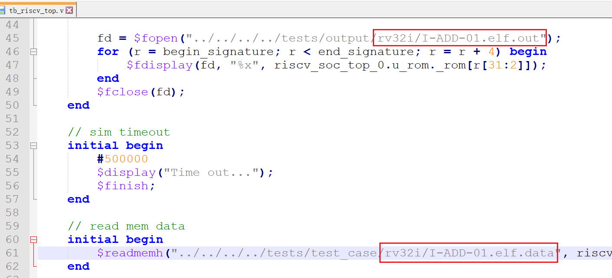

# RISC-V 处理器设计

## 1. 介绍

本人小白一枚，在学习 FPGA 的过程中偶然刷到了 tinyriscv 这个开源项目，并且自己对计算机体系结构的知识也很感兴趣，所以想参考这个开源项目做一个基于 RISC-V 指令集的 CPU，下面是 tinyriscv 这个开源项目的地址，本项目很多思路和设计都参考了 tinyriscv 开源项目：

[从零开始写RISC-V处理器 | liangkangnan的博客](https://liangkangnan.gitee.io/2020/04/29/%E4%BB%8E%E9%9B%B6%E5%BC%80%E5%A7%8B%E5%86%99RISC-V%E5%A4%84%E7%90%86%E5%99%A8/)

[tinyriscv: 一个从零开始写的极简、非常易懂的RISC-V处理器核](https://gitee.com/liangkangnan/tinyriscv#https://gitee.com/liangkangnan/tinyriscv_vivado)

另外一个基于本项目的操作系统也在同步开发中：[《一个RISC-V上的简易操作系统》](https://gitee.com/lizhanpeng2022/riscv_os)

## 2. 项目说明
本项目实现的是一个单核 32 位的小型 RISC-V 处理器核，采用 verilog 语言编写。有如下特点：
1. 支持 RV32IM 指令集（除了 FENCE 指令），通过 RISC-V 指令兼容性测试；
2. 采用哈佛结构，指令和数据分开存储；
3. 采用三级流水线，即取指，译码，执行；
4. 可以运行 C 语言程序；
5. 支持中断；
6. 支持总线；
7. 支持串口烧录程序
8. 容易移植到任何 FPGA 平台（只要资源足够）；


本项目目录结构：
1.  doc：该目录包含一些手册和文档；
2.  serial_utils：该目录包含串口烧录脚本，以及一些测试例子；
3.  FPGA：存放 FPGA 相关文件，包括 rtl 文件和仿真文件（目前还在更新中，成功移植到野火征途PRO开发板）；
4.  tests：包含 RISC-V 指令兼容性测试程序源码；

环境：
1. Quartus II 13.0sp1
2. ModelSim SE-64 10.5
3. Python 3.7

项目架构图：


## 3. 上板测试（野火征途PRO开发板）
首先选择好自己板子的型号，下面是我的板子的型号：


然后配置引脚，clk 接你板子的系统时钟，rst_n 接上板子的复位按键，gpio 接上板子的 led，uart_debug_pin 接上板子的任意按键（这里接的 key1），uart_rx 和 uart_tx 分别接板子的串口接收与发送端口：


重新编译后，将 .jic 或 .sof 文件烧录到板子上，然后进入 ```serial_utils``` 目录，打开串口烧录脚本 **serial_send.py**，修改串口号为你自己的。首先按住 key1 不动，然后执行脚本烧录流水灯程序 led_flow.bin，烧录完成后即可松开 key1：


烧录完成后，若发现板子上 led 交替闪烁，即为成功。

## 4. 运行指令测试程序
测试集存放在 ```tests/test_case``` 目录下，以 **I-ADD-01.elf.data** 为例，首先修改仿真文件 **tb_riscv_top** 的文件路径：



然后使用 modelsim 软件进行仿真，仿真完后可以看到 ```tests/output/rv32i``` 目录下 **I-ADD-01.elf.out** 文件更新，然后运行 compare.py 脚本进行比对：
```
 python ./compare.py rv32i
```
运行后可以看到指令测试结果 PASS。


## 5. 更新记录
2023年6月13号：第一次提交。

2023年6月20号：添加串口烧录模块，可以通过串口下载程序到 rom 中。

2023年6月28号：成功将cpu移植到板子上，并且跑起 c 实现的流水灯程序。

2023年7月2号：更新了 rom 和 ram 的存储模式，读出的数据要延后一个时钟周期，带来的好处是可以将 rom 和 ram 所使用的资源综合到 bram 上。

2023年7月22号：
1. 更新 RV32M 扩展指令集
2. 增加总线模块rib.v

2023年8月8号
1. 更新 ecall，ebreak 同步中断；uart异步中断
2. 更新 csr 寄存器操作

2023年8月13号
1. 新增定时器外设
2. 支持Machine模式与User模式

2023年9月11号
1. 增加指令兼容性(riscv-compliance)测试项
2. 修复了若干 bug
3. 更新了外设的地址分布，简化了总线的逻辑（rom->0x00000000 ~ 0x0fffffff,
ram->0x10000000 ~ 0x1fffffff）

## 6. 博客传送门

[RISC-V处理器的设计与实现（一）—— 基本指令集](https://blog.csdn.net/qq_51103378/article/details/131201501?spm=1001.2014.3001.5501)

[RISC-V处理器的设计与实现（二）—— CPU框架设计](https://blog.csdn.net/qq_51103378/article/details/131383341?spm=1001.2014.3001.5501)

[RISC-V处理器的设计与实现（三）—— 上板验证（基于野火征途Pro开发板）](https://blog.csdn.net/qq_51103378/article/details/131430334?spm=1001.2014.3001.5502)